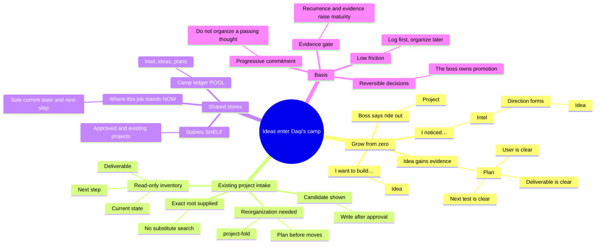
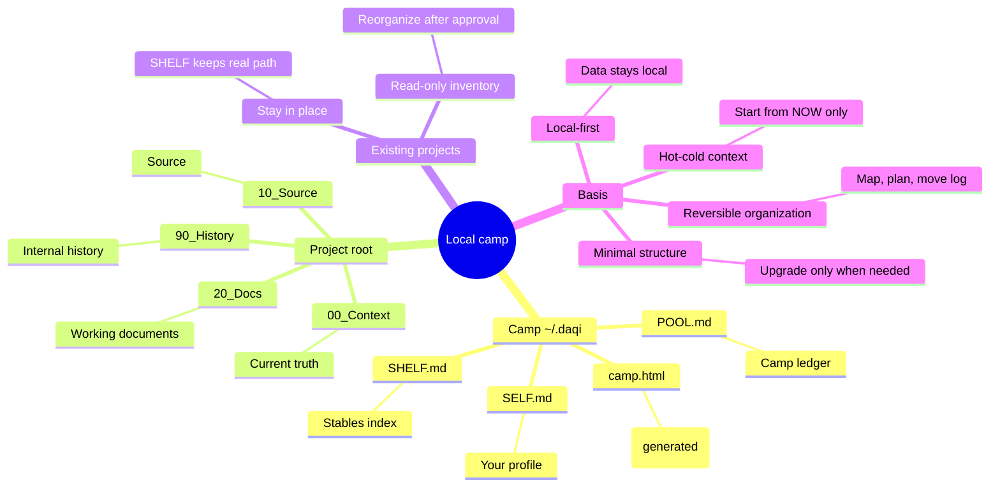

<p align="center">
  
</p>

<h1 align="center">Daqi / 达奇</h1>

<p align="center"><strong>An idea incubator. Every idea you have is held for you — Daqi never betrays you.</strong></p>

<p align="center">
  <a href="https://agentskills.io/"></a>
  <a href="LICENSE"></a>
  
  
</p>

<p align="center">
  English · <a href="README.zh-CN.md">简体中文</a>
</p>

---

## Who this is

Daqi is Dutch van der Linde from Red Dead Redemption 2 — the one who always says "I have a plan." Except this Dutch is different: **he never betrays you.**

Every pain point you mention and every idea you toss out goes into the camp ledger. He deduplicates them, grows them, and remembers where each job stands. **You are the idea king** — ideas always come from you; Daqi never invents one, never decides for you, he only holds, keeps, and grows each one until it is ready to ride. Everything stays local: nothing is uploaded, your conversations are never read, no secrets are stored.

> **One view, the whole camp.** Left: the ledger (intel · idea · plan). Right: the stables, with confirmable current progress from each project's own NOW main line. Center: the fire — your profile.

<p align="center">
  
  <br><em>The camp · Grayscale Dither Archive (placeholder image; a 30-second demo GIF will replace it)</em>
</p>

## Scenes

| Your situation | What Daqi does |
|---|---|
| Too many ideas, gone in a blink | Say "I want to build…" → an idea lands in the ledger; "I noticed…" → pain logged as intel |
| Switched Agents, explain everything again | Daqi lives in three files under `~/.daqi`; any Agent with the skill just picks it up |
| No idea how much is on your plate | "camp" shows everything: intel/idea/plan counts, stables riding/loose/stabled |
| An idea is ready | Only your "promote" puts it in the stables, creates folders, writes the main line |
| Folders are a mess | "organize <project>" → read-only inventory → a plan → nothing moves until you say so; every move is logged, nothing is deleted |
| Old projects buried in Agent history | "scan" sweeps DSH / Claude Code / Codex session metadata (cwd + timestamps only, **never transcripts**), deep-reads your selection, and finds both ideas and projects |
| Where does that job stand? | Every project carries its NOW main line: goal, verified now, next, done when — confirmable and handoff-ready |

## Core features

- **Camp ledger `POOL.md`** — the demand pool: intel (pain) → idea (intent) → plan (evidence gathered) → your go.
- **Stables `SHELF.md`** — riding / loose rein / stabled project index; each row deletable (double confirm).
- **Where this job stands `NOW.md`** — the single hot state per project: goal, verified now, next, done when.
- **Your profile `SELF.md`** — only stable preferences that change collaboration, max 12 entries.
- **Camp page `~/.daqi/camp.html`** — an offline, self-contained single page in Grayscale Dither Archive style with day/night themes; grain fire, breathing horse, wind over the ground; scrollable panels, × delete, page-switching scan tabs. Only the fire has color.
- **Scan `camp_scan.py`** — finds ideas and projects; shallow is free, deep distills through the DeepSeek brain (key entered in the page's 设置 panel, written only to local `config.json`); candidates are shown and token-confirmed before anything lands.
- **One-click organization `organize_stable.py`** — resolves the project from the stables, moves only high-confidence files, writes `cleanup-log.md`, never deletes.
- **MCP layer `daqi_mcp.py`** — an MCP stdio server with five tools (record, camp, status, scan, organize preview): one daqi brain for every MCP-capable host; `daqi_record` is the only store-writing entry point.
- **Codex automatic continuity** — No need to remember start or wrap up after one exact-root setup: Codex restores NOW at session start and checkpoints at stop. Setup asks you to review exactly three project hooks in Codex `/hooks` once; other hosts use explicit commands. No unverified native-hook claims.

## Data security

- Everything is local files: three markdown stores plus the camp page. No server, no cloud, no account.
- Bundled scripts make zero network requests; the scan reads only session `cwd` and timestamps, **never message content**.
- The API key lives only in `~/.daqi/config.json` (0600); the page's settings panel writes it locally — it never enters chat.

## Privacy & boundaries

- Never stores passwords, keys, tokens, IDs, exact addresses, financial/medical/family details, third-party data, or transcripts.
- Never promotes, deletes, or merges Git repos automatically; deletions always ask twice.
- Deep reads only project documents (NOW/README/docs); how deep is up to you.

## Install

```text
Install daqi.Skill: npx skills add pakco77/daqi.skill
Install daqi, context-fold, and project-fold. Verify that daqi is discoverable, then tell me whether I need to start a new session.
```

Exact snippets for Codex / Claude Code / Hermes / Kimi / Qwen / WorkBuddy live in the [compatibility guide](skills/daqi/references/agent-compatibility.md). First use asks two things: management language, and where new projects should live (`default_projects_root`) — "help me choose" or "later" are fine.

## Invoke

```text
Daqi: I want to build...   idea → ledger
Daqi: I noticed...         pain → intel
Daqi: promote              plan → project (only your call)
Daqi: camp                 one view of everything (renders ~/.daqi/camp.html)
Daqi: scan                 find ideas and projects in Agent history
Daqi: organize <project>   one-click folder organization (plan first)
Daqi: start / project progress / wrap up
```

“I noticed…” starts as intel; “I want to build…” starts as an idea; evidence grows an idea into a plan; only your “promote / ride out” establishes the project.

## How ideas grow into projects



## Local data logic



## Validate

```sh
python3 tests/test_rebuild_shelf.py
python3 tests/test_checkpoint.py
python3 tests/test_codex_continuity.py
python3 tests/test_camp_status.py
python3 tests/test_camp_scan.py
python3 tests/test_organize_stable.py
```

## License

[MIT](LICENSE) © 2026 Pakco
