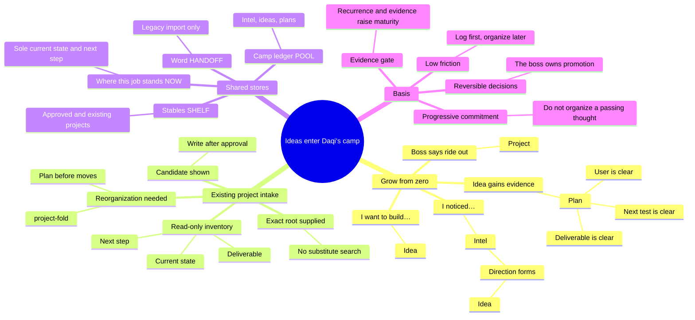
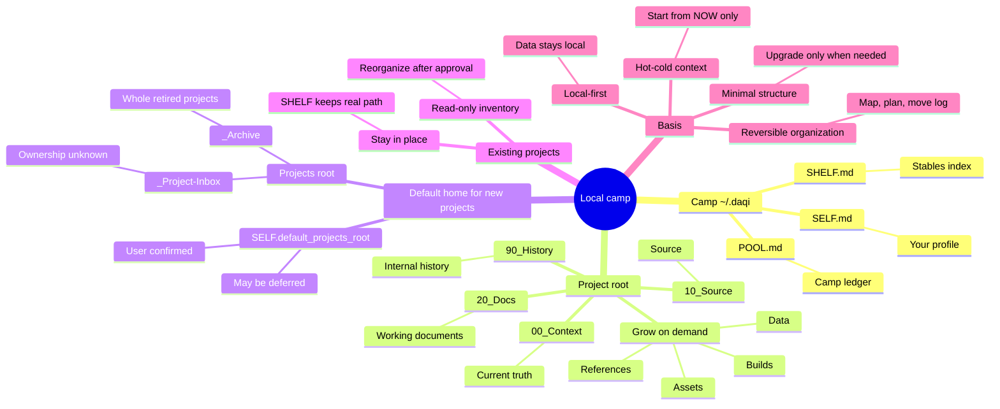

<p align="center">
  
</p>

<h1 align="center">daqi.skill / 达奇.skill</h1>

<p align="center"><strong>An idea incubator: pain points become intel, ideas grow into plans. Daqi never betrays you.</strong></p>

<p align="center">
  <a href="README.zh-CN.md">简体中文</a> · English
</p>

<p align="center">
  <a href="https://agentskills.io/"></a>
  <a href="LICENSE"></a>
  
  
</p>

## Who Daqi is

Daqi is Dutch van der Linde from Red Dead Redemption 2 — the gang leader who always has a plan. But this Dutch has one difference: **he never betrays you.**

Every pain point you mention and every idea you toss out goes into the camp ledger. Daqi deduplicates them, grows them, and remembers where each job stands — but **the gang only rides when you say go**. Data stays local in `~/.daqi`: nothing is uploaded, no full transcripts are read, no secrets are stored.

## What it does: finer-grained idea incubation

Not a memory system, not a project tool — a **demand pool + pain-point log**:

- **Pain-point log**: “I noticed…” is never lost. Pain points enter the ledger as **intel**; they are watched first, not given invented solutions.
- **Demand pool**: “I want to build…” becomes an **idea**; recurring pain and verified evidence grow an idea into a **plan**.
- **Idea to project**: only when you say “ride out” is a project established and folders created. Until then, it waits in the ledger.

## Four things in the camp

| Camp name | File | Purpose |
|---|---|---|
| Camp ledger | `POOL.md` | The demand pool: intel (pain/observation), idea (intent/hypothesis), plan (evidence gathered) |
| Your profile | `SELF.md` | Only stable preferences that change how Agents collaborate (max 12 entries) |
| Stables | `SHELF.md` | Index of projects already riding: path, activity, last Agent |
| Where this job stands | `NOW.md` | The single hot state per project: goal, verified now, next, done when |

The profile is operational, not biographical. Age is stored only as an explicitly provided, useful age band—never inferred, and never as a birthday or identity record.

## Who it is for

- People with lots of ideas and scattered pain points, whose ideas get lost or promoted too early;
- People who switch between Agents and keep re-explaining everything;
- People who want a companion that remembers every idea but never decides for them.

You do not need it for one-off chats, or when a complete team collaboration system already owns this work.

## Camp language: intel → idea → plan → ride out



This is an idea decision rule, not a psychological taxonomy. Pain is intel, thoughts are ideas, evidence turns an idea into a plan, and only you can say ride out. Existing projects do not repeat the growth path: Daqi recovers their real state first, then manages them after confirmation.

## Install

Send the matching prompt to the Agent you are using.

Recommended command:

```text
Install daqi.Skill: npx skills add pakco77/daqi.skill
Install daqi, context-fold, and project-fold. Verify that daqi is discoverable, then tell me whether I need to start a new session.
```

The installer lets you select the Skills and the Agents that need them. On one machine, select several Agents in the installer when needed. Avoid `--agent '*'` by default: it installs into every Agent directory supported by the CLI. Start a new session or restart any Agent that has not rescanned its Skills.

<details>
<summary>Codex</summary>

```text
Install daqi.Skill: npx skills add pakco77/daqi.skill --skill daqi --skill context-fold --skill project-fold --agent codex --global --yes
Verify that daqi is discoverable, then tell me whether I need to start a new session.
```
</details>

<details>
<summary>Claude Code</summary>

```text
Install daqi.Skill: npx skills add pakco77/daqi.skill --skill daqi --skill context-fold --skill project-fold --agent claude-code --global --yes
Verify that daqi is discoverable, then tell me whether I need to start a new session.
```
</details>

<details>
<summary>Hermes Agent</summary>

```text
Install daqi.Skill: npx skills add pakco77/daqi.skill --skill daqi --skill context-fold --skill project-fold --agent hermes-agent --global --yes
Verify that daqi is discoverable, then tell me whether I need to start a new session.
```
</details>

<details>
<summary>Kimi Code CLI</summary>

```text
Install daqi.Skill: npx skills add pakco77/daqi.skill --skill daqi --skill context-fold --skill project-fold --agent kimi-code-cli --global --yes
Verify that daqi is discoverable, then tell me whether I need to start a new session.
```
</details>

<details>
<summary>Qwen Code</summary>

```text
Install daqi.Skill: npx skills add pakco77/daqi.skill --skill daqi --skill context-fold --skill project-fold --agent qwen-code --global --yes
Verify that daqi is discoverable, then tell me whether I need to start a new session.
```
</details>

<details>
<summary>Other Agent Skills hosts</summary>

```text
Confirm this host's exact npx skills --agent identifier, then install daqi, context-fold, and project-fold from pakco77/daqi.skill; do not default to --agent '*'.
Verify that daqi is discoverable, then tell me whether I need to start a new session.
```
</details>

<details>
<summary>WorkBuddy</summary>

```text
Install daqi, context-fold, and project-fold from pakco77/daqi.skill into WorkBuddy's user-level ~/.workbuddy/skills/ directory. If npx skills writes only to ~/.agents/skills/ or reports that PromptScript does not support global installation, inspect and back up any existing same-name targets before copying the three complete Skill folders.
Use WorkBuddy's Skill tool to verify that daqi is discovered and loaded, then use `达奇 项目进度` to verify shared-store access and tell me whether I need to start a new session.
```
</details>

WorkBuddy dynamically scans `~/.workbuddy/skills/` (discovery and triggering were verified there for the earlier implementation of this same mechanism); after the rename, verify once with `达奇 项目进度`. This verifies the manual workflow, not a native SessionStart hook.

Discovery-only check:

```sh
npx skills add pakco77/daqi.skill --list
```

See the [compatibility guide](skills/daqi/references/agent-compatibility.md) for verified host status. On first use, one compact message asks for management language and a default home for new project material; the user may provide a path, ask Daqi to recommend one, or defer it. On Windows, “help me choose” prefers a user-confirmed non-system fixed drive but never falsely promises to avoid `C:` when no suitable alternative exists. Chinese folders and bilingual mapping usually cost slightly more tokens.

## Automatic continuity in Codex

No need to remember start or wrap up after one exact-root setup. In an enrolled project, Codex restores one compact `NOW.md` at session entry. Before a stable final response, the Agent decides from evidence whether nothing changed (`NO_DELTA`), the four action fields should change (`PROPOSE_UPDATE`), or a user-owned choice blocks a truthful checkpoint (`NEEDS_DECISION`). The Stop hook is the only writer.

Setup remains explicit and narrow:

1. Ask Daqi to preview automatic continuity for the exact project root. Preview makes no writes.
2. Inspect the exact diffs for `NOW.md`, project `.codex/hooks.json`, and the local Git exclude entry when applicable.
3. Confirm once to apply that unchanged preview.
4. Open Codex `/hooks` in the project and review exactly the SessionStart, UserPromptSubmit, and Stop hooks.

`CONFIGURED_NEEDS_HOOKS_REVIEW` means configured, not trusted. The adapter never edits global Codex settings. It binds enrollment to the exact real root, invalidates it after a move or copy, serializes concurrent Agents, refuses stale baselines, writes atomically, and preserves supported file metadata or fails closed. `plan` and `bypassPermissions` modes are zero-write. See the [automatic-continuity contract](skills/daqi/references/automatic-continuity.md) for enable, status, conflict, and disable behavior.

## Invoke

```text
$daqi
/daqi
Daqi: start
Daqi: project progress
Daqi: I want to build...
Daqi: I noticed...
Daqi: ride out
Daqi: organize this existing project /path/to/project
Daqi: wrap up

达奇：开工
达奇：项目进度
达奇：我想做……
达奇：我发现……
达奇：出发
达奇：收工
```

“I noticed…” is a pain point or observation and starts as intel. “I want to build…” is intent and starts as an idea. Evidence grows an idea into a plan; only your “ride out” establishes the project. The old `mishu` / `秘书` names no longer trigger anything.

## Local data logic



Only a new project without an explicit root uses the confirmed `default_projects_root`; existing projects stay in place. A normal project starts with only `00_Context`, `10_Source`, `20_Docs`, and `90_History`; other directories appear only when real files need them. Chinese mode saves a complete English-Chinese folder map before any move. Every move is logged; nothing is deleted automatically.

## Repository structure

```text
daqi.skill/
├── skills/
│   ├── daqi/                   # Camp ledger, profile, stables, growth mechanism
│   │   ├── SKILL.md
│   │   ├── assets/            # SELF / SHELF / POOL / NOW / HANDOFF templates
│   │   ├── references/        # Profile, hook, and host contracts
│   │   └── scripts/           # Install, Codex continuity adapter, and SHELF rebuild
│   ├── context-fold/          # NOW.md hot-cold context
│   └── project-fold/          # Minimal folders and reversible moves
├── tests/                     # Redacted SHELF reconstruction fixtures
├── docs/                      # Mechanism design docs (mishu-era heritage, mechanism retained)
├── assets/                    # Public icon
├── README.md
├── README.zh-CN.md
└── LICENSE
```

## Boundaries

- Bundled scripts make no network requests; content read by an Agent remains subject to that runtime's data policy.
- Never store passwords, API keys, tokens, identity numbers, exact addresses, financial, medical, family, third-party private information, or full transcripts.
- Show a rebuilt SHELF candidate before writing it.
- In enrolled Codex projects, only the exact-root Stop adapter writes managed `NOW.md`; global SELF/SHELF/POOL stores are never changed by that automatic path.
- Never create a project silently, delete files automatically, or merge Git repositories.
- Show a move plan first; back up the bilingual folder map in Chinese mode; log every move for reversal.

## Validate

```sh
python3 tests/test_rebuild_shelf.py
python3 tests/test_checkpoint.py
python3 tests/test_codex_continuity.py
npx skills add . --list
```

## License

[MIT](LICENSE) © 2026 Pakco
