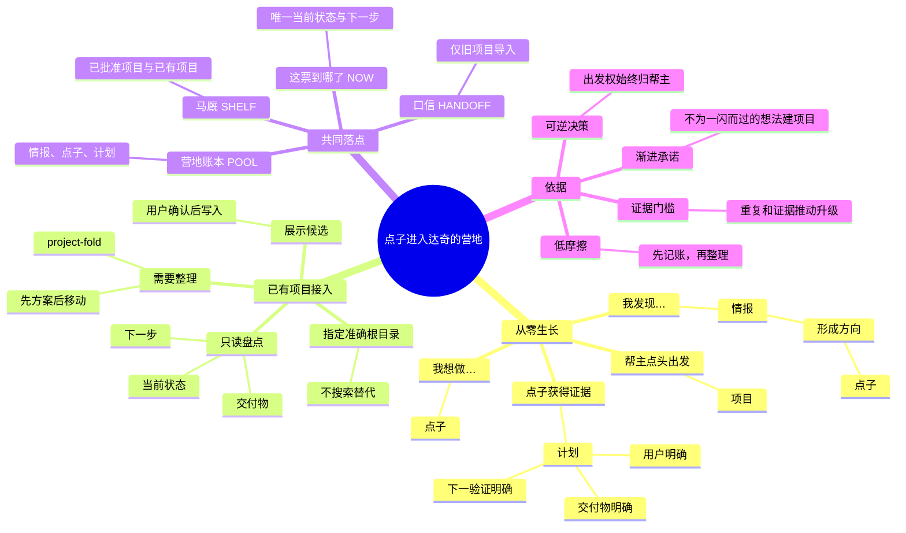
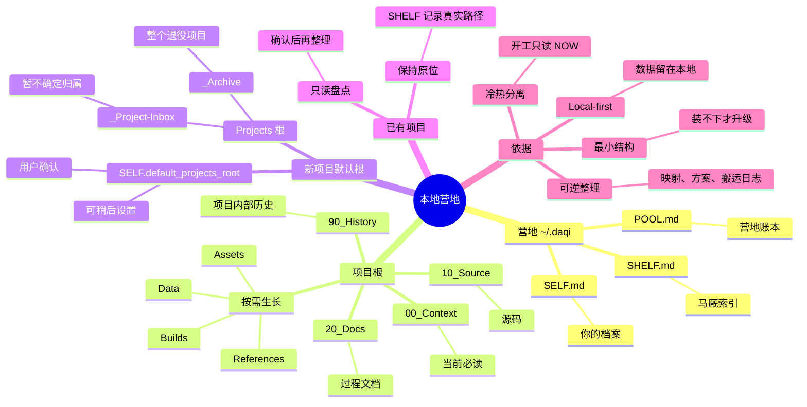

<p align="center">
  
</p>

<h1 align="center">达奇.skill / daqi.skill</h1>

<p align="center"><strong>点子孵化器：痛点记成情报，点子养出计划。你是点子王，达奇帮你收住点子。</strong></p>

<p align="center">
  简体中文 · <a href="README.md">English</a>
</p>

<p align="center">
  <a href="https://agentskills.io/"></a>
  <a href="LICENSE"></a>
  
  
</p>

## 达奇是谁

达奇是《荒野大镖客 2》里的 Dutch van der Linde——永远把“我有一个计划”挂在嘴边的帮派头儿。但这一版达奇有一个不同点：**他不会背叛你。**

你随口提的每个痛点、每个点子，他都替你记进营地账本；他会去重、会养大、会记得每一票干到哪了，但**只有你点头，队伍才出发**。**你才是点子王**：点子永远出自你，达奇不发明、不替你拍板，只负责把每一条点子收住、守住、养到能出发。数据全在本地 `~/.daqi`，不上传、不读完整对话、不存秘密。

## 它是做什么的：更精细的点子孵化

不是记忆系统，不是项目工具，而是一个**需求池 + 痛点记录**：

- **痛点记录**：`我发现…` 一条也不会丢。痛点进账本成为「情报」，先盯着，不急着给方案。
- **需求池**：`我想做…` 成为「点子」；重复出现的痛点和验证过的证据，会把点子养到「计划」。
- **从点子到项目**：只有当你说「出发」，才立项、建目录。你不说，它就一直在账本里待命。

## 营地里的四样东西

| 营地叫法 | 文件 | 用途 |
|---|---|---|
| 营地账本 | `POOL.md` | 需求池：情报（痛点/观察）、点子（意图/假设）、计划（证据齐了） |
| 你的档案 | `SELF.md` | 只记会改变 Agent 协作方式的稳定偏好（最多 12 条） |
| 马厩 | `SHELF.md` | 已在跑的项目索引：路径、活跃度、最近 Agent |
| 这票到哪了 | `NOW.md` | 每个项目唯一的热状态：目标、已验证、下一步、完成条件 |

你的档案只保留会改变协作方式的信息。年龄只记用户明确提供且确实有用的年龄段；不推断，不存生日、证件、密钥或精确私人信息。

## 谁适合

- 想法多、痛点杂，点子容易丢或太早立项的人；
- 在多个 Agent 之间切换、每次都要重新解释的人；
- 想要一个「永远记得你的点子、但从不替你拍板」的伙伴的人。

不需要：一次性问答；已有完整团队协作系统替你管着这一切的人。

## 营地语言：情报 → 点子 → 计划 → 出发



这不是心理学分类，而是一套点子生长规则：痛点是情报，想法是点子，证据让它长成计划，只有你能决定出发。已有项目不需要重走生长链，先恢复真实状态，确认后再纳入马厩。

## 安装

把对应提示词发给你正在使用的 Agent。

推荐命令：

```text
请安装 daqi.Skill：npx skills add pakco77/daqi.skill
安装 daqi、context-fold、project-fold。装完验证能发现 daqi，并告诉我是否需要开启新会话。
```

安装器会让你选择 Skill 和当前需要使用的 Agent。同一台机器需要多端时，在安装器里多选；不要默认使用 `--agent '*'`，它会向 CLI 支持的全部 Agent 目录安装。通常需要新开会话或重启尚未重新扫描 Skill 的 Agent。

<details>
<summary>Codex</summary>

```text
请安装 daqi.Skill：npx skills add pakco77/daqi.skill --skill daqi --skill context-fold --skill project-fold --agent codex --global --yes
装完验证能发现 daqi，并告诉我是否需要开启新会话。
```
</details>

<details>
<summary>Claude Code</summary>

```text
请安装 daqi.Skill：npx skills add pakco77/daqi.skill --skill daqi --skill context-fold --skill project-fold --agent claude-code --global --yes
装完验证能发现 daqi，并告诉我是否需要开启新会话。
```
</details>

<details>
<summary>Hermes Agent</summary>

```text
请安装 daqi.Skill：npx skills add pakco77/daqi.skill --skill daqi --skill context-fold --skill project-fold --agent hermes-agent --global --yes
装完验证能发现 daqi，并告诉我是否需要开启新会话。
```
</details>

<details>
<summary>Kimi Code CLI</summary>

```text
请安装 daqi.Skill：npx skills add pakco77/daqi.skill --skill daqi --skill context-fold --skill project-fold --agent kimi-code-cli --global --yes
装完验证能发现 daqi，并告诉我是否需要开启新会话。
```
</details>

<details>
<summary>Qwen Code</summary>

```text
请安装 daqi.Skill：npx skills add pakco77/daqi.skill --skill daqi --skill context-fold --skill project-fold --agent qwen-code --global --yes
装完验证能发现 daqi，并告诉我是否需要开启新会话。
```
</details>

<details>
<summary>其他 Agent Skills 宿主</summary>

```text
请先确认当前 Agent 在 npx skills 中的准确 --agent 标识，再从 pakco77/daqi.skill 安装 daqi、context-fold、project-fold；不要默认使用 --agent '*'。
装完验证能发现 daqi，并告诉我是否需要开启新会话。
```
</details>

<details>
<summary>WorkBuddy</summary>

```text
请把 pakco77/daqi.skill 的 daqi、context-fold、project-fold 安装到 WorkBuddy 用户级目录 ~/.workbuddy/skills/。如果 npx skills 只写入 ~/.agents/skills/ 或报告 PromptScript 不支持全局安装，先检查并备份已有同名目录，再复制三个完整 Skill 目录。
用 WorkBuddy 的 Skill 工具验证 daqi 能发现并加载，再用 `达奇 项目进度` 验证它能读取共享 store；告诉我是否需要开启新会话。
```
</details>

WorkBuddy 会动态扫描 `~/.workbuddy/skills/`（同一机制的旧实现已在 WorkBuddy 验证过发现与触发）；改名后建议安装完用 `达奇 项目进度` 做一次触发验证。这是手动工作流验证，不代表存在原生 SessionStart hook。

安装前可只检查发现结果：

```sh
npx skills add pakco77/daqi.skill --list
```

完整兼容状态见[兼容指南](skills/daqi/references/agent-compatibility.md)。第一次使用时，达奇会用一条消息确认管理语言和新项目默认资料目录；目录可以指定、让达奇建议或稍后设置。Windows 上“帮我选”会优先建议用户确认的非系统固定盘，但不会在只有 `C:` 时作虚假承诺。中文目录与中英映射通常会多消耗一点 token。

## Codex 自动连续性

完成一次精确项目根设置后，不用记开工或收工。进入已纳管项目时，Codex 自动恢复一份精简的 `NOW.md`；每个稳定回复结束前，Agent 根据证据判断：没有实质变化（`NO_DELTA`）、四个行动字段应更新（`PROPOSE_UPDATE`），还是需要用户决定才能诚实保存（`NEEDS_DECISION`）。只有 Stop hook 能写入受管 NOW。

启用流程保持明确、窄授权：

1. 让达奇为这个精确项目根生成自动连续性预览；预览零写入。
2. 检查 `NOW.md`、项目 `.codex/hooks.json`，以及适用时本地 Git exclude 的精确差异。
3. 确认一次，应用这份未变化的预览。
4. 在该项目打开 Codex `/hooks`，只审核 SessionStart、UserPromptSubmit、Stop 三个 hook。

`CONFIGURED_NEEDS_HOOKS_REVIEW` 只表示文件已配置，不代表 Codex 已信任。适配器不会修改 Codex 全局设置；它绑定精确 real root，项目移动或复制后授权失效，并发 Agent 串行写入，过期 baseline 拒绝覆盖，写入原子完成，文件元数据能完整保留才写，否则关闭失败。`plan` 与 `bypassPermissions` 模式零写入。启用、状态、冲突与停用细节见[自动连续性契约](skills/daqi/references/automatic-continuity.md)。

## 调用

```text
$daqi
/daqi
达奇：开工
达奇：项目进度
达奇：我想做……
达奇：我发现……
达奇：出发
达奇：营地
达奇：整理已有项目 /path/to/project
达奇：收工

Daqi: start
Daqi: project progress
Daqi: I want to build...
Daqi: I noticed...
Daqi: wrap up
```

`我发现…` 是痛点或观察，进「情报」；`我想做…` 是意图，进「点子」；证据让点子长成「计划」；只有你确认「出发」才立项。旧的 `秘书` / `mishu` 称呼已不再触发。

## 营地盘点（只读）

```text
达奇：营地 / 盘点 / 清点
Daqi: camp
```

达奇清点账本和马厩——情报/点子/计划各多少、在跑/松了/歇马各多少，并把完整档案渲染成 `~/.daqi/camp.html`。全程只读：只解析 POOL 与 SHELF，绝不写入任何 store。

盘点页面遵循「灰阶点阵档案 Grayscale Dither Archive」风格：65% 米白 + 20% 浅灰 + 10% 纯黑 + 5% 点阵纹理；1px 实线边框、黑白反转交互、点阵填充状态；1-bit Floyd–Steinberg 抖动大图、4 级 Bayer 4×4 抖动缩略图；正文现代无衬线，数字/标签/时间用等宽字体；帧感离散动效。

## 本地数据逻辑



新项目没有明确路径时，才使用用户确认的 `default_projects_root`；已有项目默认保持原位。普通项目只需要 `00_Context`、`10_Source`、`20_Docs`、`90_History`，其他目录有真实内容时才创建。中文模式先保存完整中英目录映射，再移动文件。所有移动写日志，不自动删除。

## 仓库结构

```text
daqi.skill/
├── skills/
│   ├── daqi/                   # 营地账本、你的档案、马厩与生长机制
│   │   ├── SKILL.md
│   │   ├── assets/            # SELF / SHELF / POOL / NOW / HANDOFF 模板与图标
│   │   ├── references/        # 档案规则、hook、Agent 兼容契约
│   │   └── scripts/           # 安装、Codex 连续性适配器与 SHELF 重建
│   ├── context-fold/          # NOW.md 冷热分离
│   └── project-fold/          # 最小目录、升级与可逆搬运
├── tests/                     # SHELF 脱敏 fixture 与重建测试
├── docs/                      # 机制设计文档（mishu 时代遗产，机制沿用）
├── assets/                    # 公开图标
├── README.md
├── README.zh-CN.md
└── LICENSE
```

## 边界

- 脚本不发网络请求；Agent 读取的内容仍受所选 runtime 的数据政策约束。
- 不存密码、API key、token、证件、精确地址、财务医疗家庭隐私、第三方隐私或完整对话。
- SHELF 重建结果先展示，确认后才写入。
- 已纳管 Codex 项目里，只有绑定精确根目录的 Stop 适配器能写受管 `NOW.md`；自动路径不会修改全局 SELF/SHELF/POOL。
- 不自动立项、不自动删除、不合并 Git 仓库。
- 项目移动前先给方案；中文目录先备份中英映射；每次移动都写可反向恢复的日志。

## 验证

```sh
python3 tests/test_rebuild_shelf.py
python3 tests/test_checkpoint.py
python3 tests/test_codex_continuity.py
npx skills add . --list
```

## License

[MIT](LICENSE) © 2026 Pakco
