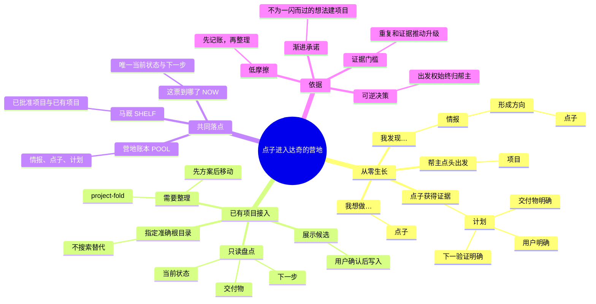
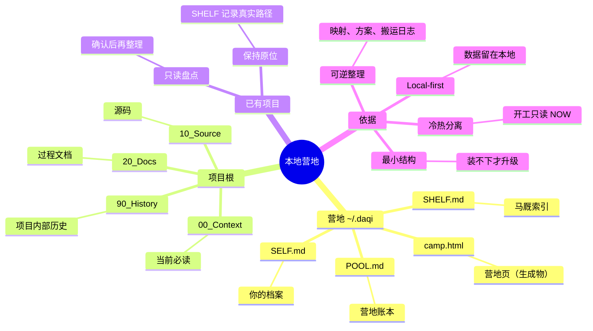

<p align="center">
  
</p>

<h1 align="center">达奇</h1>

<p align="center"><strong>点子孵化器。你的每个点子都有人收着——达奇不会背叛你。</strong></p>

<p align="center">
  <a href="https://agentskills.io/"></a>
  <a href="LICENSE"></a>
  
  
</p>

<p align="center">
  <a href="README.md">English</a> · 简体中文
</p>

---

## 这是谁

达奇是《荒野大镖客 2》里那个永远说「我有一个计划」的 Dutch van der Linde——但这一版不一样：**他不会背叛你。**

你随口说的每个痛点、每个点子，他都记进营地账本；他会去重、会养大、会记住每一票干到哪了。**你才是点子王**，点子永远出自你；达奇不发明、不替你拍板，只负责把每一条收住、守住、养到能出发。数据全在本地，不上传、不读你的对话、不存秘密。

> **营地一眼看全。** 左侧账本（情报 · 点子 · 计划）、右侧马厩（20 匹在跑）、中央火堆（你的档案）——马厩里每一匹都带着可确认的当前进度，来自各项目自己的 NOW 主线。

<p align="center">
  
  <br><em>营地 · 灰阶点阵档案（占位图；30 秒演示 GIF 之后替换这里）</em>
</p>

## 场景

| 你遇到的事 | 达奇做什么 |
|---|---|
| 脑子里点子太多，转个头就忘 | 说「我想做……」，点子进账本；说「我发现……」，痛点记成情报 |
| 换了个 Agent，一切要重新解释 | 达奇住在 `~/.daqi` 的三个文件里，任何 Agent 装上就能接着干 |
| 不知道手上到底有多少活 | 「盘点」一眼看全：情报/点子/计划各多少，马厩在跑/松了/歇马各多少 |
| 点子养到能干了 | 你说「立项」，它才进马厩、建文件夹、写主线 |
| 文件夹乱成一团 | 「整理 <项目>」只读盘点 → 出方案 → 你点头才搬，每次移动写日志，永不删除 |
| 老项目散在各 Agent 的会话历史里 | 「扫描」扫 DSH / Claude Code / Codex 的会话元数据（只读 cwd+时间戳，**不读对话**），单选/多选深读，点子和项目都找得回来 |
| 想知道某票干到哪了 | 每匹马都带 NOW 主线：目标、已验证、下一步、完成条件，可确认、可交接 |

## 核心功能

- **营地账本 `POOL.md`**：需求池。情报（痛点）→ 点子（意图）→ 计划（证据齐了）→ 你点头立项。
- **马厩 `SHELF.md`**：在跑 / 松了 / 歇马的项目索引，每条可删除（二次确认）。
- **这票到哪了 `NOW.md`**：每个项目唯一的热状态——目标、已验证、下一步、完成条件。
- **你的档案 `SELF.md`**：只记会改变协作方式的稳定偏好，最多 12 条。
- **营地页 `~/.daqi/camp.html`**：离线、自包含的单页营地。灰阶点阵档案风格，昼夜两套配色；火焰颗粒、马匹微动、风掠地面；弹窗内滚动、X 删除、扫描分页切换。全营只有火有颜色。
- **扫描 `camp_scan.py`**：找点子找项目，shallow 免费启发式，deep 走 DeepSeek 大脑（key 在营地页「设置」里填，只落本机 `config.json`）；候选先过目、token 确认才入库。
- **一键整理 `organize_stable.py`**：从马厩定位项目，高置信度才移动，Medium/Low 留原地，每次移动写 `cleanup-log.md`。
- **Codex 自动连续性**：一次精确根设置后，不用记开工或收工——Codex 会话自动恢复 NOW、收工自动存档。设置时只需在 Codex `/hooks` 里审核一次三个项目 hook；其余宿主用命令仪式，不吹原生 hook。

## 数据安全

- 全部数据是本地文件：`~/.daqi` 三个 markdown + 营地页。没有服务器、没有云、没有账号。
- 自带脚本零网络请求；扫描只读会话的 `cwd` 和时间戳，**从不读对话内容**。
- API key 只写本机 `~/.daqi/config.json`（权限 0600），营地页的「设置」直写本地，key 不进聊天。

## 隐私与边界

- 不存密码、密钥、token、证件、精确地址、财务医疗家庭隐私、第三方隐私、完整对话。
- 不自动立项、不自动删除、不合并 Git 仓库；删除都要二次确认。
- 深读只读项目文档（NOW/README/docs），读多读少你说了算（丰俭由人）。

## 安装

```text
请安装 daqi.Skill：npx skills add pakco77/daqi.skill
安装 daqi、context-fold、project-fold。装完验证能发现 daqi，并告诉我是否需要开启新会话。
```

Codex / Claude Code / Hermes / Kimi / Qwen / WorkBuddy 的精确安装片段见[兼容指南](skills/daqi/references/agent-compatibility.md)。第一次使用会问你两件事：管理语言、新项目默认放哪（`default_projects_root`）——可以「帮我选」或「稍后设置」。

## 调用

```text
达奇：我想做……     点子进账本
达奇：我发现……     痛点记成情报
达奇：立项          计划成熟才出发
达奇：盘点          营地一眼看全（生成 ~/.daqi/camp.html）
达奇：扫描          从 Agent 历史里找点子和项目
达奇：整理 <项目>    一键整理文件夹（先方案后移动）
达奇：开工 / 项目进度 / 收工
```

`我发现…` 是痛点，进「情报」；`我想做…` 是意图，进「点子」；证据让点子长成「计划」；只有你确认「立项 / 出发」才立项。

## 点子怎么长成项目



## 本地数据逻辑



## 验证

```sh
python3 tests/test_rebuild_shelf.py
python3 tests/test_checkpoint.py
python3 tests/test_codex_continuity.py
python3 tests/test_camp_status.py
python3 tests/test_camp_scan.py
python3 tests/test_organize_stable.py
```

## License

[MIT](LICENSE) © 2026 Pakco
